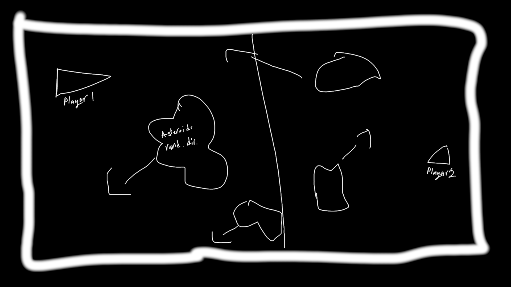
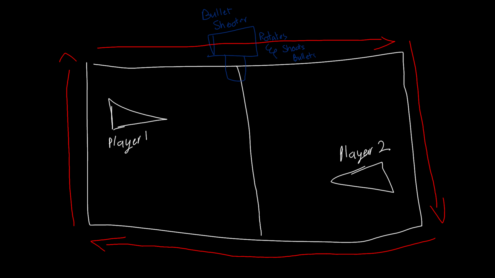
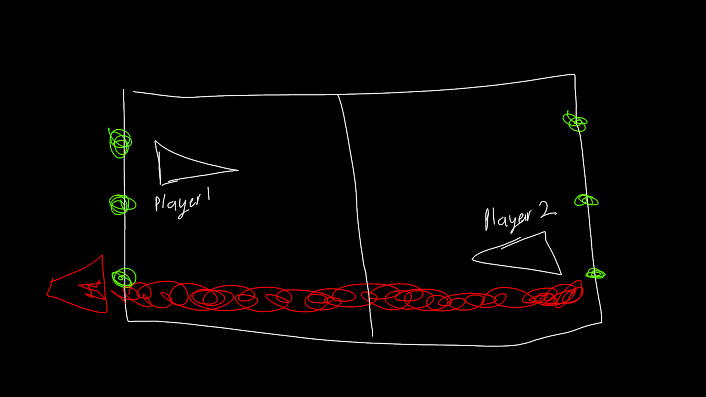

*This is a brief list of things we have to do, or later we will do*

# Abilities
*Might be added later!*

- [ ] Invincibility 
- When player is invincible he is RGB and he changes his colors

- [ ] Dash
- Dashing in a fixed direction based on input to dodge bullets

- [ ] Parry
- Parrying causes the bullet to reverse its direction and color, it increases the speed and damage by 1.5x
- After parrying the bullet cant hit you, you become to_ignore.

# Levels

- [ ] Asteroid Level  
  - Asteroids appear and move in a fixed random direction. After receiving enough damage, they explode. Asteroids will be rare.
  

	
Example Image

	
   
  

  

- [ ] Flasher Level (Suggest a better name!)  
  - A bullet-shooting machine rotates around the orbits of the map and shoots bullets.  
  

	
Example Image

	
   
  

- [ ] Draconic Level  
  - A dragon-like entity appears on a random green point and shoots a laser in a straight line.  
   

	
Example Image

	
   
  

- [ ] Tutorial Level  
  - Explains controls and when to use different types of bullets.

# Accessibility
- [ ] Game's hit-stop is frame rate dependent right now, we will have to fix it.
- [ ] Color blind settings
- Although i tried my best to make it possible to use shapes to signify different objects
- [ ] Outline Settings
- To make the objects easier to focus, maybe implement this.
- [ ] Vignette Flash Togglee
- Vignette flashes when near death, add a toggle for it.

# Audio
*"@YellowDude ye ap ka kam hai"*
- [ ] Multiple layered audio, for intense situations or when the player is near death.
- [ ] Shoot sounds
- [ ] Hit sounds
- [ ] Ability recharge sounds
- [ ] Bullets recharge sounds

# Effects
- [ ] Multiple Transition Screens
- [ ] Player spawn animation

# Networking
- [ ] **IDK how i will go about doing this, but i wont use steam network.**

# Bullets

### 1. Big Bullet
- [x] Scythe Bullet
- Is fixed at pivot at handle and rotates, also deals more damage at the tip
  
- [ ] Slasher bullet
- They cover a huge area but deal little damage.
  
- [ ] Bomb bullet
- A bullet which explodes after a given team, dealing AOE damage.

### 2. Small Bullet
- [x] Boomerang Bullet
- Goes forward and then returns back like a boomerang
  
- [X] Homing Bullet
- Heat-seek the player for a time, when it has fuel and runs out quickly
  
### 3. Normal Bullet
- [X] Missile Bullet
- Starts slow and picks up speed, its damage increases with increase in speed
  
- [ ] Dual Bullet
- Shoots a bullet, which breaks into two bullets.
- One goes diagonally up and the other goes diagonally down.

# UI
- [x] HUD
- Maybe add ability charge-meter later 
- [ ] Rayyan says ui sucks, i agree time to fix it :C
- [X] Working UI
- [x] A neonish good looking ui, with health and bullet 
- Somewhat done :C

# Trailer
- [ ] Show case different levels
- [ ] Show case different bullets
- [ ] Try to get views and GitHub-stars :C
- [ ] Music should be synced with effects, for maximum coolness.

**Progression:**
1. A single bullet is in focus, and it is traveling slowly, the camera zooms out a little and shows a spaceship.
2. The spaceship dodges the bullet and the camera suddenly zooms out, revealing the entire stage.
3. Camera fades out.
4. Revealing the level-select screen. (Feels weird tho)
5. Showcase swap-able bullets
6. With the player at a constant position, swap levels at an increasing speed.
7. Increasing game-play intensity
8. Showcase abilities.
9. In the ending show the DRACONIC enemy charging the laser.
10. Suddenly End the trailer.
- Showcase different colored bullets.

# Suggestions
- Adeel: Too much screenshake after player death.
- Adeel: Weapon equip UI is confusing.
- Everyone: Brep sound is bad.
